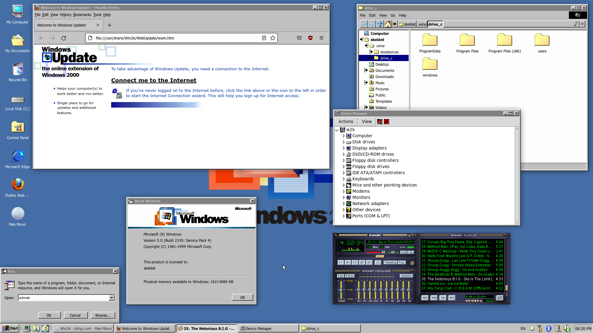
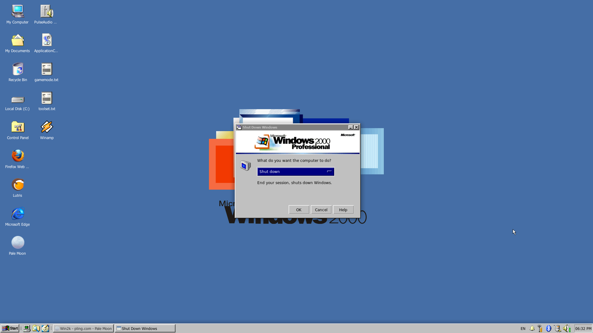

# Win2k
#### Windows 2000 Professional XFCE Total Conversion

<h1><a href="https://www.opencode.net/etondy/win2k/-/archive/main/win2k-main.tar.gz">Download</a></h1>

### Installation of requirements
In order to run type "chmod +x install_requirements.sh && sudo ./install_requirements.sh" in terminal to install system requirements.

### Requirements

- GTK+ 3.22 or 3.24
- Xfce 4.12, 4.14, 4.16
- gtk2-engines-pixbuf (Recommended for GTK2 applications)
- A Window compositor

### Screenshots

### Code and license
License: GPL-3.0+/MIT

#

